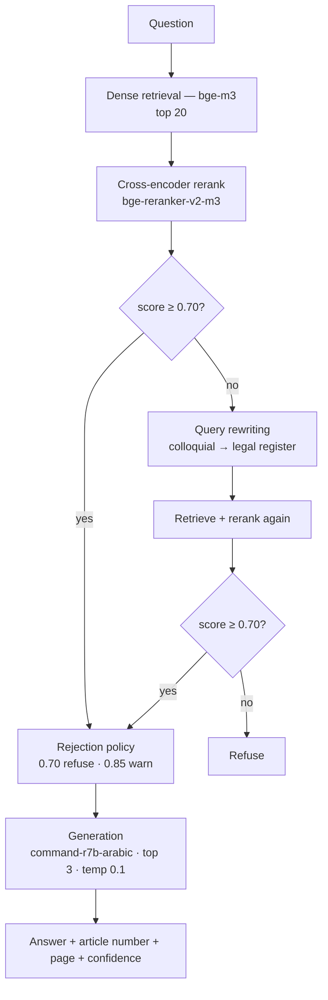

# Saudi PDPL RAG — مستشار الأنظمة السعودية

An Arabic retrieval-augmented question answering system over the Executive
Regulations of the Saudi Personal Data Protection Law. Answers are generated only
from retrieved articles, cite the article number, and can be verified against the
page of the official source document. Runs entirely locally — no external API calls
at query time.

## Modes

| Mode | Corpus | Status |
|---|---|---|
| **Executive Regulations** | 38 articles, pre-indexed | Measured — all figures below describe this mode |
| **Uploaded document** | Any Arabic PDF up to 20MB, indexed at query time | Experimental — generic chunking, threshold exposed to the user |

## Pipeline



## Stack

Python 3.11 · PyTorch (MPS) · sentence-transformers · Ollama · Streamlit · PyMuPDF

| Component | Model | Licence |
|---|---|---|
| Embeddings | BAAI/bge-m3 | MIT |
| Reranking | BAAI/bge-reranker-v2-m3 | Apache 2.0 |
| Generation & query rewriting | command-r7b-arabic | CC-BY-NC (non-commercial) |

## Corpus

| | |
|---|---|
| Source | Executive Regulations of the Saudi PDPL (SDAIA) |
| Articles extracted | 38 / 38 |
| Mean article length | 1,006 characters |
| Manual QA | 20 articles reviewed — `eval/corpus_qa.md` |

Arabic PDF extraction required handling Unicode presentation forms, right-to-left
block ordering, bidi-displaced punctuation, and intra-word spacing introduced by PDF
justification. Article detection: 32/38 → 38/38.

## Evaluation

Two hand-labelled question sets, gold-labelled by reviewing retrieved candidates:

| Set | Questions | Purpose |
|---|---|---|
| `eval/eval_set.json` | 85 (75 in-scope + 10 out-of-scope), 5 question types | Retrieval quality |
| `eval/colloquial.json` | 22 (14 in-scope + 8 out-of-scope) | Behaviour on questions as a real user types them |

`src/eval/regression.py` compares all retrieval metrics against a committed baseline.

## Retrieval results

Measured on the 75 in-scope questions.

| System | Hit@1 | Hit@5 | Rec@5 | MRR | nDCG@10 |
|---|---|---|---|---|---|
| BM25 baseline | 0.55 | 0.73 | 0.71 | 0.64 | 0.68 |
| Dense (bge-m3) | 0.79 | 0.99 | 0.97 | 0.86 | 0.88 |
| **+ cross-encoder rerank** | **0.91** | **1.00** | 0.97 | **0.94** | **0.94** |

Median top-1 score, in-scope vs out-of-scope: **0.81 vs 0.05** (16× separation), which
is what makes the rejection threshold robust. Under BM25 the same gap is 1.4×.

## End-to-end results

Rejection policy: refuse below 0.70, warn below 0.85. Query rewriting is invoked only
when the first retrieval scores below threshold.

| Question set | Coverage | Precision | Out-of-scope blocked |
|---|---|---|---|
| Formal (75 questions) | 91% | 90% | 100% |
| Colloquial (14 questions) | 79% | 91% | 88% |

Threshold behaviour is flat across 0.65–0.80, so the system does not depend on fine
tuning of that value.

## Generation

Three models compared on identical retrieved contexts, identical system prompt,
identical temperature (0.1).

| Model | Cited | Cited correctly | Arabic purity | Out-of-scope refusal |
|---|---|---|---|---|
| **command-r7b-arabic** | **93%** | **93%** | 100% | 100% |
| qwen2.5:7b-instruct | 68% | 68% | 90% | 100% |
| ALLaM-7B-Instruct-preview | 43% | 43% | 100% | 100% |

**No incorrect citations in any model** — cited and cited-correctly are identical
throughout. The failure mode is omission, never fabrication.

### Manual faithfulness review

20 answers from the selected model, reviewed individually (`eval/faithfulness.md`):

| | |
|---|---|
| Fully supported by the cited article | 93% |
| **Hallucinations** | **0** |
| False refusals | **0** |
| Correct refusals on out-of-scope questions | 4 / 4 |

## Uploaded-document mode

Generic chunking (900 characters, 150 overlap, sentence boundaries, page tracked),
in-memory index, same reranker and generation. Scanned PDFs are detected and reported.

Calibrated by running this corpus through the upload path against the same 85 questions:

| Pipeline | Hit@1 | Hit@5 |
|---|---|---|
| Article-aware chunking | 0.907 | 1.000 |
| Generic chunking | 0.853 | 0.973 |

| Threshold | Coverage | Precision | Out-of-scope blocked |
|---|---|---|---|
| 0.30 | 92% | 84% | 100% |
| 0.50 (default) | 81% | 87% | 100% |
| 0.70 | 73% | 87% | 100% |

The threshold is exposed as a slider, since it is calibrated on one document only.
Query rewriting is disabled on this path — it encodes this corpus's vocabulary.

## Known limitations

- Corpus covers the Executive Regulations only. The Law itself is a scanned PDF and
  requires OCR. Cross-border data transfer is governed by a separate regulation and is
  not in this corpus.
- 10 out-of-scope questions in the main set, so the rejection threshold is tuned on a
  coarse sample.
- `multi` questions: retrieval surfaces all relevant articles, generation covers 1–2.
- Colloquial questions whose key term is misspelled are not recovered.
- Manual review by a single annotator; no inter-annotator agreement measured.
- Answers cite a page but the passage is not highlighted: this PDF stores Arabic as
  glyph runs rather than words, so text search on the page does not match.

## Running it

**Requirements:** Python 3.11, [Ollama](https://ollama.com), ~6 GB free disk, 16 GB RAM.

```bash
git clone https://github.com/turkifaris/saudi-pdpl-rag.git
cd saudi-pdpl-rag
python3.11 -m venv .venv && source .venv/bin/activate
pip install -r requirements.txt
ollama pull command-r7b-arabic
streamlit run app.py
```

Embedding and reranking models download from Hugging Face on first run (~4.4 GB, once).
The corpus and its vectors are committed, so no rebuild is needed.

### Rebuilding the corpus

Place the source PDF at `data/raw/pdpl_regulations.pdf` — see `data/raw/SOURCES.md`.

```bash
python src/pipeline/ingest.py
python src/pipeline/clean.py
python src/pipeline/chunk.py
python src/core/embed.py
```

### Reproducing the figures

```bash
python src/eval/evaluate.py bm25
python src/eval/evaluate.py dense
python src/eval/evaluate.py rerank
python src/eval/eval_colloquial.py
python src/eval/eval_upload.py
python src/eval/regression.py --full
```

## Repository layout

```
app.py              Streamlit interface
src/core/           the running system: retrieval, reranking, rewriting, policy, generation
src/pipeline/       corpus construction from the source PDF
src/eval/           evaluation, calibration and the regression test
src/archive/        one-off diagnostics and measured-and-rejected experiments
data/               corpus, embeddings, extraction intermediates
eval/               question sets, gold labels, results, baseline
```

`src/README.md` documents every file.

## Licence

Code: MIT. The corpus is an SDAIA publication and the generation model is
non-commercial — see `NOTICE`.

This project is not legal advice and is not affiliated with SDAIA.
